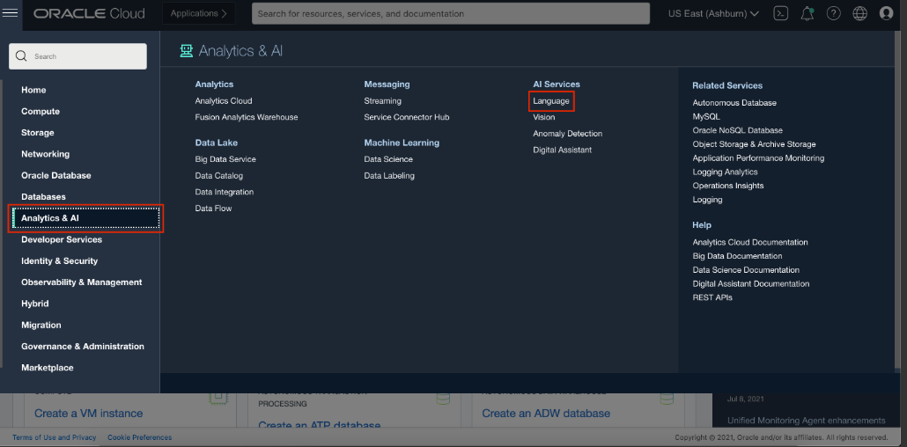
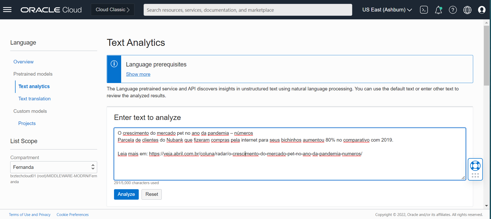

O OCI Language capacita os desenvolvedores com modelos pré-treinados prontos para produção para automatizar análises de texto sofisticadas em escala sem exigir nenhum conhecimento de aprendizado de máquina. O OCI Language pode ser ser acessado por meios de APIs Rest e SDKs.

## Recursos de processamento de idioma pré-treinados:

1. Análise de sentimentos
2. Reconhecimento de entidade nomeada
3. Extração de frase chave
4. Detecção de idioma
5. Classificação de Texto

## Use a Console para analisar textos

1 - Navegue até o OCI Language
Navegue até o idioma OCI. Faça login no OCI Cloud Console. Usando o menu Burger no canto superior esquerdo, navegue até o menu Analytics e AI e clique nele e selecione o item Idioma em serviços AI.

2 - Digite o texto
Digite seu texto na caixa de diálogo para analisar.

Abaixo estão alguns exemplos para o texto:

´O crescimento do mercado pet no ano da pandemia – números
Parcela de clientes do Nubank que fizeram compras pela internet para seus bichinhos aumentou 80% no comparativo com 2019. 
Leia mais em: https://veja.abril.com.br/coluna/radar/o-crescimento-do-mercado-pet-no-ano-da-pandemia-numeros/´

