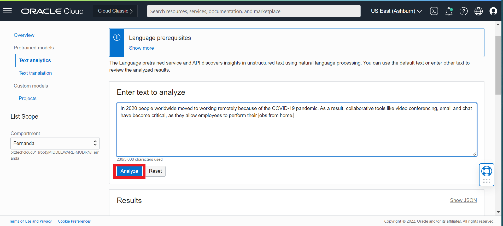
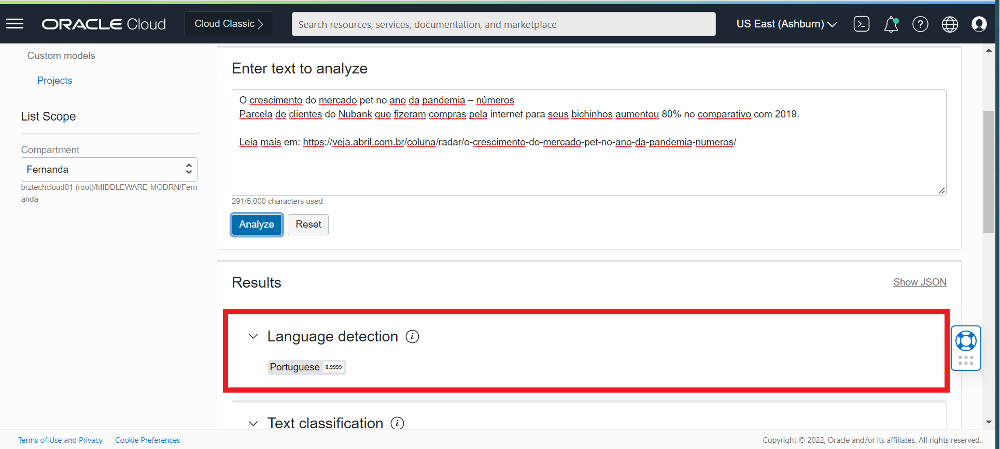
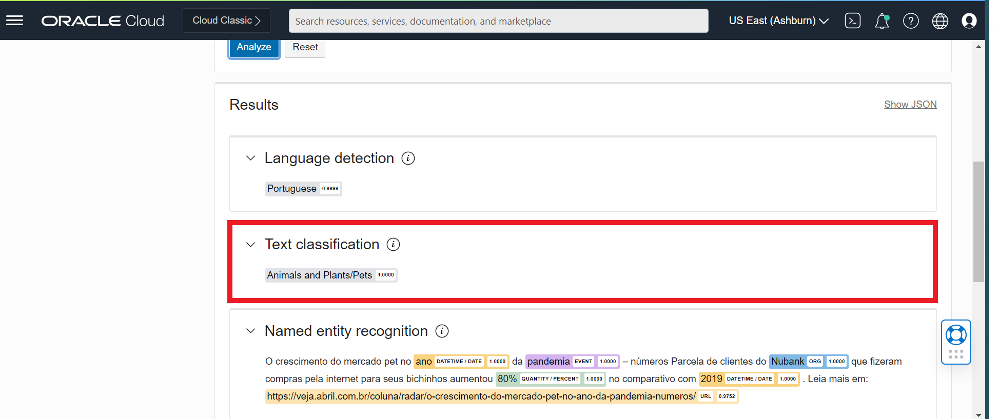
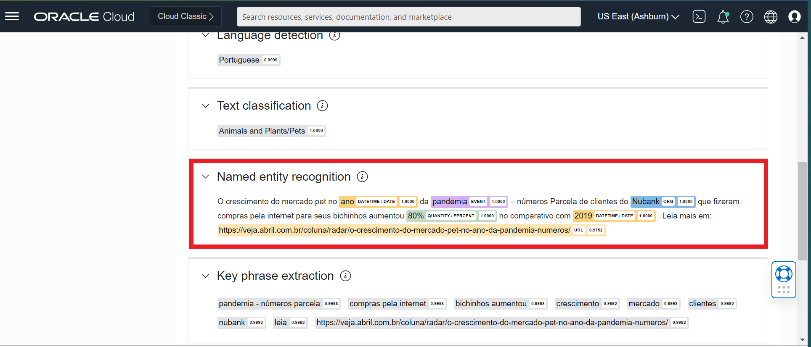
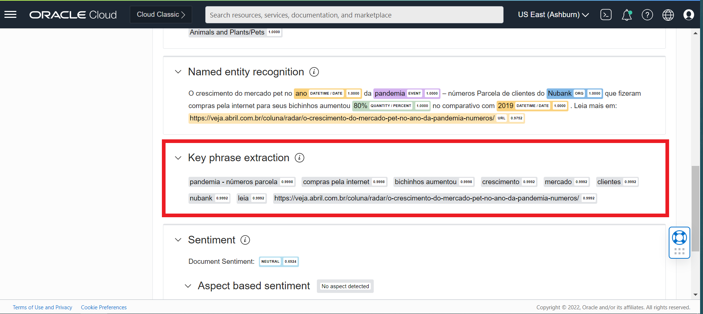
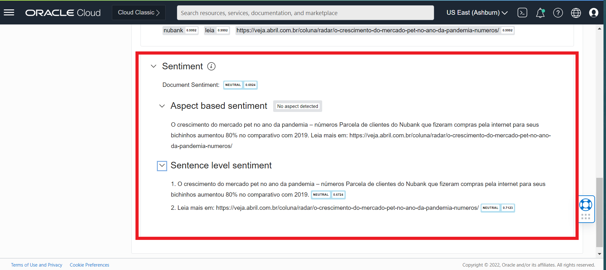
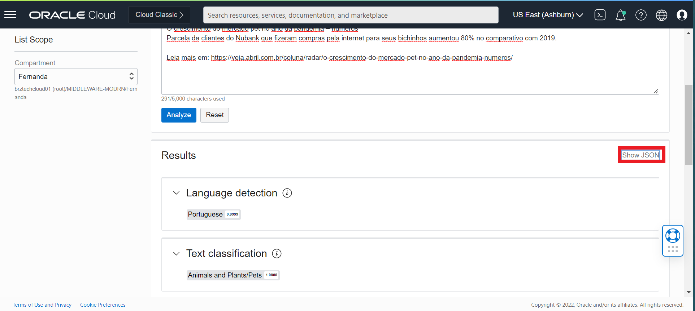
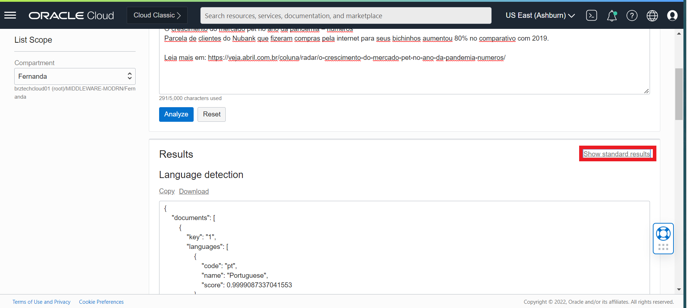

O OCI Language capacita os desenvolvedores com modelos pré-treinados prontos para produção para automatizar análises de texto sofisticadas em escala sem exigir nenhum conhecimento de aprendizado de máquina. O OCI Language pode ser ser acessado por meios de APIs Rest e SDKs.

## Recursos de processamento de idioma pré-treinados:

1. Análise de sentimentos
2. Reconhecimento de entidade nomeada
3. Extração de frase chave
4. Detecção de idioma
5. Classificação de Texto

## Use a Console para analisar textos

1 - Navegue até o OCI Language
Navegue até o idioma OCI. Faça login no OCI Cloud Console. Usando o menu Burger no canto superior esquerdo, navegue até o menu Analytics e AI e clique nele e selecione o item Idioma em serviços AI.


2 - Digite o texto
Digite seu texto na caixa de diálogo para analisar.


Abaixo estão alguns exemplos para o texto:

`O crescimento do mercado pet no ano da pandemia – números
Parcela de clientes do Nubank que fizeram compras pela internet para seus bichinhos aumentou 80% no comparativo com 2019. 
Leia mais em: https://veja.abril.com.br/coluna/radar/o-crescimento-do-mercado-pet-no-ano-da-pandemia-numeros/`

`In 2020 people worldwide moved to working remotely because of the COVID-19 pandemic. As a result, collaborative tools like video conferencing, email and chat have become critical, as they allow employees to perform their jobs from home.`

3 - Clique em Analisar

Você pode analisar o texto clicando no botão Analyze.



## Visualizando os resultados
Depois de analisar seu texto, o serviço do Language exibe os resultados por categoria para as ferramentas selecionadas da seguinte forma:

1 - Language Detection

Lista, por porcentagem de confiança, os idiomas detectados.



2 - Text Classification

Lista a palavra, a categoria de documento identificada e a pontuação de confiança.



3 - Named entity recognition

Identifica as entidades nomeadas que foram encontradas e suas categorias são indicadas.



4 - Key phrase extraction

Lista as frases-chave detectadas no texto.



5 - Sentiment Analysis

Renderiza o nível do documento, o sentimento com base no aspecto e no nível da frase com pontuação.



## Visualizando os resultados em JSON

Você pode clicar no botão Mostrar JSON para visualizar a saída de cada um dos recursos no formato JSON.



Clique no botão Mostrar resultados padrão para sair da visualização JSON.



# Acesse OCI Language com SDKs 

O Oracle Cloud Infrastructure fornece vários Kits de Desenvolvimento de Software (SDKs) para facilitar o desenvolvimento de soluções personalizadas. Os SDKs permitem que você crie e implante aplicativos que se integram aos serviços do Oracle Cloud Infrastructure. Cada SDK também inclui ferramentas e artefatos necessários para desenvolver um aplicativo, como amostras de código e documentação. Além disso, se você quiser contribuir com o desenvolvimento dos SDKs, todos eles são de código aberto e estão disponíveis no GitHub.
Você pode invocar os recursos do OCI Language por meio dos SDKs OCI. Nesta sessão de laboratório, vários trechos de código serão mostrados para acessar o OCI Language por meio dos SDKs OCI. Você não precisa executar os snippets, mas revise-os para entender quais informações e etapas são necessárias para implementar sua própria integração. Além disso, você pode encontrar exemplos de linguagem OCI em diferentes linguagens de programação neste [repositório do github.](https://github.com/oracle-samples/oci-data-science-ai-samples/tree/master/ai_services/language)

1 - [SDK Para Java](https://docs.oracle.com/en-us/iaas/Content/API/SDKDocs/javasdk.htm#SDK_for_Java)

2 - [SDK Para Python](https://docs.oracle.com/en-us/iaas/Content/API/SDKDocs/pythonsdk.htm#SDK_for_Python)

3 - [SDK Para TypeScript e JavaScript](https://docs.oracle.com/en-us/iaas/Content/API/SDKDocs/typescriptsdk.htm#SDK_for_TypeScript_and_JavaScript)

4 - [SDK Para .NET](https://docs.oracle.com/en-us/iaas/Content/API/SDKDocs/dotnetsdk.htm#SDK_for_NET)

5 - [SDK Para Go](https://docs.oracle.com/en-us/iaas/Content/API/SDKDocs/gosdk.htm#SDK_for_Go)

6 - [SDK Para Ruby](https://docs.oracle.com/en-us/iaas/Content/API/SDKDocs/rubysdk.htm#SDK_for_Ruby)

## Chave de assinatura da API de configuração e arquivo de configuração

**Pré-requisito: Antes de gerar um par de chaves, crie o diretório .oci em seu diretório inicial para armazenar as credenciais.**

Mac OS / Linux:

```mkdir ~/.oci
```


